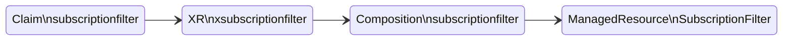

## Test with CloudWatch Subscription Filter


Setup the environment with the following variables

```shell
export KINESIS_CLAIM_NAME="kinesis-firehose-s3-lambda"
export CLOUDWATCH_LOG_GROUP="/aws/eks/crossplane-blueprints/cluster"
export DESTINATION_KINESIS_ARN=$(kubectl get firehoseapps.awsblueprints.io ${KINESIS_CLAIM_NAME} \
  -o 'jsonpath={.status.kinesisArn}')
export CLOUDWATCH_LOGS_ROLE=$(kubectl get firehoseapps.awsblueprints.io ${KINESIS_CLAIM_NAME} \
  -o 'jsonpath={.status.cloudwatchlogsRoleArn}')
export NAMESPACE="default"
```


You can use the AWS Console or CLI to add a CloudWatch subscription filter:

```shell
aws logs put-subscription-filter \
  --log-group-name  "${CLOUDWATCH_LOG_GROUP}" \
  --filter-name "dynatrace-aws-logs" \
  --filter-pattern "" \
  --destination-arn "${DESTINATION_KINESIS_ARN}" \
  --role-arn "${CLOUDWATCH_LOGS_ROLE}"
```

This example provides a Crossplane Composition to add a CloudWatch subscription filter


Use the file template `claim-subscription-tmpl.yaml` to create the file `claim-subscription.yaml`

You can use the following command:
```shell
envsubst < "templates/claim-subscription-tmpl.yaml" > "claim-subscription.yaml"
```

>Currently there is an [issue](https://github.com/upbound/upjet/issues/95) with Upbound crossplane provider in SubcriptionFilters using matchSelectors only work with Kinesis Stream, not other destinations.


Apply the claim
```
kubectl apply -f claim-subscription.yaml
```

Validate the claim
```
kubectl get subscriptionfilters.awsblueprints.io
```

Expected result (it might take sometime before READY=True)
```
NAME                           SYNCED   READY   CONNECTION-SECRET   AGE
kinesis-firehose-s3-lambda   True     True                        27s
```

The claim will create the following resources:

Each XR in the diagram contains the underlying resource refs:
```
kubectl describe xfirehoseapps | grep "Resource Refs" -A 3
```

Expected output:
```
  Resource Refs:
    API Version:  cloudwatchlogs.aws.upbound.io/v1beta1
    Kind:         SubscriptionFilter
    Name:         subscriptionfilter-kinesis-firehose-s3-lambda-kw9c2
```


Validate that the cloudwatch log subscription filter is added by using the AWS Console (Cloud Watch -> Logs -> Log groups -> Subscription Filter)